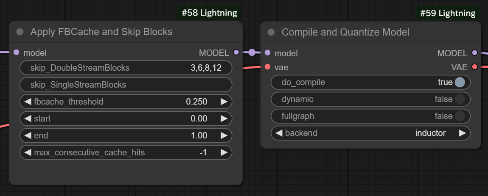
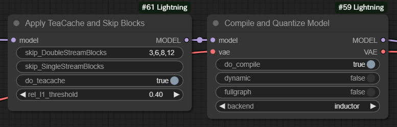

# ComfyUI-Lightning

The codes are modified from [ComfyUI-TeaCache](https://github.com/welltop-cn/ComfyUI-TeaCache), [comfyui-flux-accelerator](https://github.com/discus0434/comfyui-flux-accelerator) and [Comfy-WaveSpeed](https://github.com/chengzeyi/Comfy-WaveSpeed).

I use follow tips to accelerate FLUX inference speed:

1. Add `TeaCache` or `FBCache`;
2. Skip some unnessasery blocks;
3. Compile and quantize model;
4. Use fast CuDNN attention kernels.

More details see above given repositories.

## Usage

