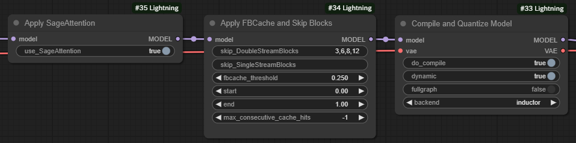
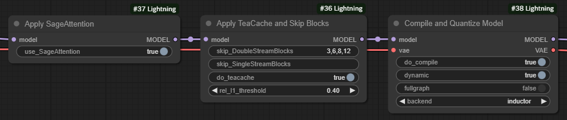
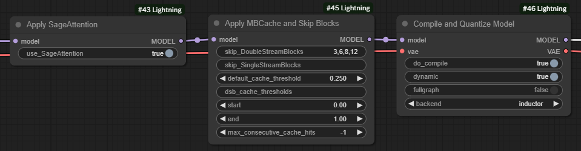

# ⚡ComfyUI-Lightning

## Introduction

This repository integrates all the tricks I know to speed up Flux inference:

1. Use `TeaCache` or `FBCache` or `MBCache`;
2. Skip some unnessasery blocks;
3. Compile and quantize model;
4. Use fast CuDNN attention kernels;
5. Use SageAttention;
6. Fix `AttributeError: 'SymInt' object has no attribute 'size'` to speed up recompilation after resolution changing.

`MBCache` extends `FBCache` and is applied to cache multiple blocks. The codes are modified from [SageAttention](https://github.com/thu-ml/SageAttention), [ComfyUI-TeaCache](https://github.com/welltop-cn/ComfyUI-TeaCache), [comfyui-flux-accelerator](https://github.com/discus0434/comfyui-flux-accelerator) and [Comfy-WaveSpeed](https://github.com/chengzeyi/Comfy-WaveSpeed). More details see above given repositories.

## Updates

- \[2025/1/24\] Now support [Sana](https://github.com/NVlabs/Sana). Get your 1024*1024 images within 2s. All the codes are modified from [Sana](https://github.com/NVlabs/Sana).

## Usage

### For Flux

### For Sana

1. Download Sana diffusion model from [Model Zoo](https://github.com/NVlabs/Sana/blob/main/asset/docs/model_zoo.md) and put the `.pth` file into `models/diffusion_models`;

2. Download Gemma text encoder from [google/gemma-2-2b-it](https://huggingface.co/google/gemma-2-2b-it), [unsloth/gemma-2b-it-bnb-4bit](https://huggingface.co/unsloth/gemma-2b-it-bnb-4bit) or [Efficient-Large-Model/gemma-2-2b-it](https://huggingface.co/Efficient-Large-Model/gemma-2-2b-it) and put the whole folder into `models/text_encoders`;

3. Download DCAE image decoder from [mit-han-lab/dc-ae-f32c32-sana-1.0](https://huggingface.co/mit-han-lab/dc-ae-f32c32-sana-1.0) and put the `.safetensors` file into `models/vae`;

4. Run the example [workflow](./examples/sana_example_workflow.json).
