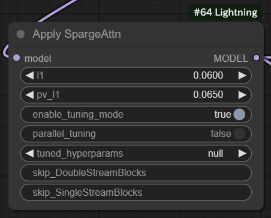

# ⚡ComfyUI-Lightning

## Introduction

This repository integrates all the tricks I know to speed up Flux inference:

1. Use `TeaCache` or `FBCache` or `MBCache` or `ToCa`;
2. Skip some unnessasery blocks;
3. Compile and quantize model;
4. Use fast CuDNN attention kernels;
5. Use `SageAttention` or `SpargeAttn`;
6. Fix `AttributeError: 'SymInt' object has no attribute 'size'` to speed up recompilation after resolution changing.

`MBCache` extends `FBCache` and is applied to cache multiple blocks. The codes are modified from [SageAttention](https://github.com/thu-ml/SageAttention), [ComfyUI-TeaCache](https://github.com/welltop-cn/ComfyUI-TeaCache), [comfyui-flux-accelerator](https://github.com/discus0434/comfyui-flux-accelerator) and [Comfy-WaveSpeed](https://github.com/chengzeyi/Comfy-WaveSpeed). More details see above given repositories.

## Updates

- \[2025/3/10\] Add [SpargeAttn](https://github.com/thu-ml/SpargeAttn). For more details, see [Usage](#for-spargeattn).
- \[2025/2/27\] Add [ToCa](https://github.com/Shenyi-Z/ToCa).
- \[2025/1/24\] Now support [Sana](https://github.com/NVlabs/Sana). Get your 1024*1024 images within 2s. All the codes are modified from [Sana](https://github.com/NVlabs/Sana).

## Usage

### For Flux


You can use `XXCache`, `SageAttention`, and `torch.compile` with the following examples:


More specific:

1. Download Flux diffusion model and VAE image decoder from [FLUX.1-dev](https://huggingface.co/black-forest-labs/FLUX.1-dev) or [FLUX.1-schnell](https://huggingface.co/black-forest-labs/FLUX.1-schnell). Put the `flux1-dev.safetensors` or `flux1-schnell.safetensors` file into `models/diffusion_models` and the `ae.safetensors` file into `models/vae`;
2. Download Flux text encoder from [flux_text_encoders](https://huggingface.co/comfyanonymous/flux_text_encoders) and put all the `.safetensors` files into `models/clip`;
3. Run the example [workflow](./examples/flux_example_workflow.json).

### For Sana


1. Download Sana diffusion model from [Model Zoo](https://github.com/NVlabs/Sana/blob/main/asset/docs/model_zoo.md) and put the `.pth` file into `models/diffusion_models`;
2. Download Gemma text encoder from [google/gemma-2-2b-it](https://huggingface.co/google/gemma-2-2b-it), [unsloth/gemma-2b-it-bnb-4bit](https://huggingface.co/unsloth/gemma-2b-it-bnb-4bit) or [Efficient-Large-Model/gemma-2-2b-it](https://huggingface.co/Efficient-Large-Model/gemma-2-2b-it) and put the whole folder into `models/text_encoders`;
3. Download DCAE image decoder from [mit-han-lab/dc-ae-f32c32-sana-1.0](https://huggingface.co/mit-han-lab/dc-ae-f32c32-sana-1.0) and put the `.safetensors` file into `models/vae`;
4. Run the example [workflow](./examples/sana_example_workflow.json).

### For SpargeAttn

SpargeAttn is an attention acceleration method based on SageAttention, which requires hyperparameter tuning before using. The tuning process is shown in the following steps:

1. First you should follow the steps below to install `SpargeAttn`. If you have problems installing it, see the original [repository](https://github.com/thu-ml/SpargeAttn);

   ```bash
   git clone https://github.com/thu-ml/SpargeAttn.git
   cd ./SpargeAttn
   pip install -e .
   ```

2. If you do not have a hyperparameter file, you should perform a few rounds of quality fine-tuning to get one first. You just need to open the `enable_tuning_mode` of the node `Apply SpargeAttn` and perform the generation. For example, generate 50-step 512*512 images at 10 different prompts (very time-consuming);

   

   > - The `skip_DoubleStreamBlocks` and `skip_SingleStreamBlocks` arguments are used to skip certain blocks that do not require the use of `SpargeAttn`, mainly to work with `TeaCache` and `FBCache`.
   > - Enable `parallel_tuning ` to utilize multiple GPUs to accelerate tuning. In this case, you need to start ComfyUI with the argument `--disable-cuda-malloc`.
   > - If you have a well-tuned hyperparameter file, feel free to share it.

3. Turn off `enable_tuning_mode` and use the `Save Finetuned SpargeAttn Hyperparams` node to save your hyperparameter file;

   

4. Remove or disable the `Save Finetuned SpargeAttn Hyperparams` node and place the saved hyperparameter file in the `models/checkpoints` folder. Load this hyperparameter file in the `Apply SpargeAttn` node;

   

5. Enjoy yourself.

To make tuning hyperparameters easier, I've provided an example [workflow](./examples/flux_spargeattn_tuning_example_workflow.json) here. This workflow defaults to generating a 50-step 512*512 image for each of the 10 preset prompts (which can be modified as you see fit). Click on the `Queue` button to start tuning. Of course, you need to make sure you have the right environment before you start. Again, this process is very time consuming.
